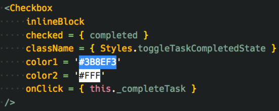

<table align="center">
    <tbody>
        <tr>
            <td>
                <h3 align="center">👋🏼 Добро пожаловать на интенсив!</h3>
                

                    🏎📸&nbsp;Данный репозиторий — это стартовая точка твоего персонального проекта. Целью самостоятельного выполнения персонального проекта является закрепление полученных тобой знаний. Так что не медли. Клонируй репозиторий, и начинай кодить! 🔥
                

                 
                
👨🏽‍🔬&nbsp;В этой инструкции ты узнаешь как настроить и использовать проект.

            </td>
        </tr>
    <tbody>
</table>

 

## 📜 Содержание

-   [🚀 Для запуска проекта выполни следующие шаги](#-Для-запуска-проекта-выполни-следующие-шаги)
-   [🤖 Краткий обзор команд для проекта](#-Краткий-обзор-команд-для-проекта)
-   [🎨 Концептуальное задание](#-Концептуальное-задание)
-   [👨🏼‍💻 Техническое задание](#-Техническое-задание)
-   [🤔 FAQ](#-faq)

 

### 🚀 Для запуска проекта выполни следующие шаги

1. [Скачай и установи](https://nodejs.org/en/) последнюю LTS-версию Node.js.
2. Выполни в консоли `node -v` и убедись, что установлена последняя версия Node.js не ниже `v8.11.3`;
3. Введи в консоли `npm -v` и убедись, что установлена последняя версия npm не ниже `5.6.0`;
4. [Скачай и установи Git](https://git-scm.com/downloads), если его нет на компьютере;
5. Введи `git --version`, чтобы проверь версию установленного Git, должно быть не ниже `2.18.0`;
6. Склонируй и запусти этот проект: `git clone https://github.com/Lectrum/react-personal-project.git`;
7. Чтобы перейти в директорию с проекта, после клонирования выполни команду `cd react-personal-project`;
8. Чтобы установить зависимости проекта, выполни команду `npm install`;
9. Чтобы запустить проект в режиме разработки, самое время выполнить  команду`npm start`;
10. Перейди в браузер и открой страничку [http://localhost:3000](http://localhost:3000/). Когда страничка загрузится, ты увидишь страницу с сообщением «Персональный проект: стартовая точка».
11. Открой Chrome Dev Tools и перейди на вкладку Console, там не должно быть каких-либо ошибок.

 
 

### 🤖 Краткий обзор команд для проекта

> Заметка: запускать через `yarn «имя команды»` или `npm run «имя команды»`.

| Команда           | Описание                                                                        |
| ----------------- | ------------------------------------------------------------------------------- |
| `start`           | запустить проект для разработки                                                 |
| `build:prod`      | запустить сборку проекта                                                        |
| `build:analyze`   | запустить сборку проекта и запустить режим детального анализа результата сборки |
| `lint:javascript` | провести анализ исходного JavaScript-кода на стилистические ошибки              |
| `lint:css`        | провести анализ исходного CSS-кода на стилистические ошибки                     |
| `lint`            | провести анализ всего исходного кода на стилистические ошибки                   |
| `test`            | запустить тесты                                                                 |
| `test:watch`      | запустить тесты в watch-режиме                                                  |
| `test:debug`      | запустить тесты в debug-режиме                                                  |
| `soundcheck`      | запустить все линтеры и тесты                                                   |
| `prettier`        | отформатировать исходный код с помощью prettier                                 |
| `deploy`          | задеплоить приложение на свой Github Pages                                      |

> Заметка: после деплоя на Github Pages приложение будет доступно по адресу:\
> https://`имя-твоего-пользователя-гитхаб`.github.io/`имя-твоего-репозитория-с-приложением`

 

### 🎨 Концептуальное задание

Для успешного выполнения персонального проекта нужно удовлетворить следующие критерии:

- ✅ Приложение должно успешно запуститься и работать;
- Приложение должно уметь выполнять следующие операции с задачами:
    - ✅ Создавать новую задачу;
    - ✅ Получать все задачи;
    - ✅ Удалять задачу;
    - ✅ Редактировать текст задачи;
    - ✅ Отметить задачу как выполненную;
    - ✅ Отметить задачу как приоритетную;
    - ✅ Отметить все задачи как выполненные.
- ✅ Все операции с задачами нужно подключить к API;
- ✅ Нужно сделать фильтр по задачам;
- ✅ При входе в режим редактирования, фокус ввода должен сместиться в поле с текстом задачи;
- ✅ Завершить редактирование задачи можно нажатием на клавишу Enter;
- ✅ Отменить редактирование задачи можно нажатием на клавишу Escape;
- ✅ Длина сообщения новой и редактируемой задачи не должна превышать 50 символов;
- ✅ Задачи должны сортироваться: сперва — приоритетные, затем — обычные, и в конце — выполненные.

---

В директории `source/instruments` находится компонент высшего порядка `withSvg`: с его помощью можно использовать SVG-разметку в качестве React-компонентов. Декорированные компоненты-SVG находятся в директории `source/theme/assets`.

Пример использования:

---

 

### 🤔 FAQ

Ответы на часто задаваемые вопросы можно найти [здесь](https://github.com/Lectrum/FAQ#-faq).

 

  <!-- Сделано с любовь -->
    

